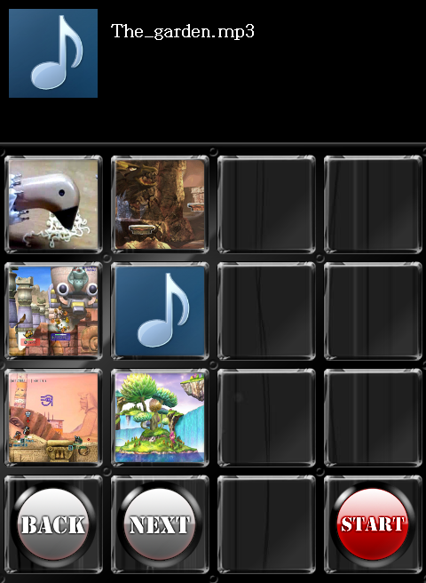
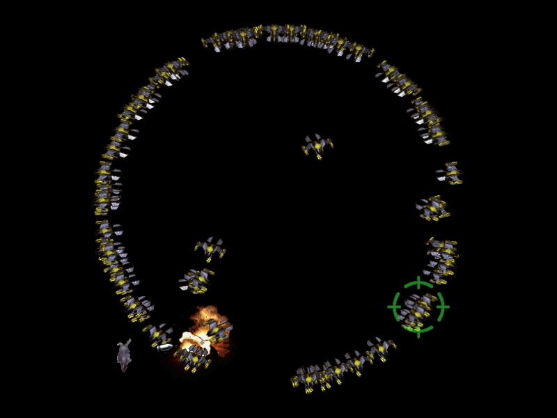
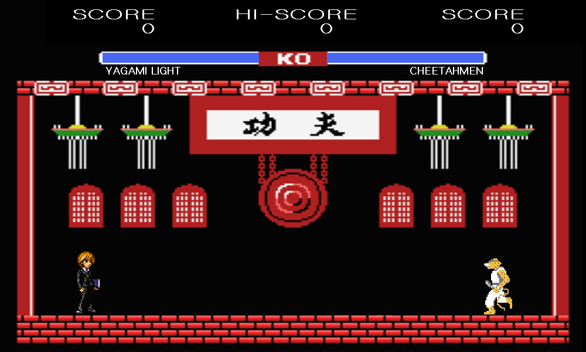
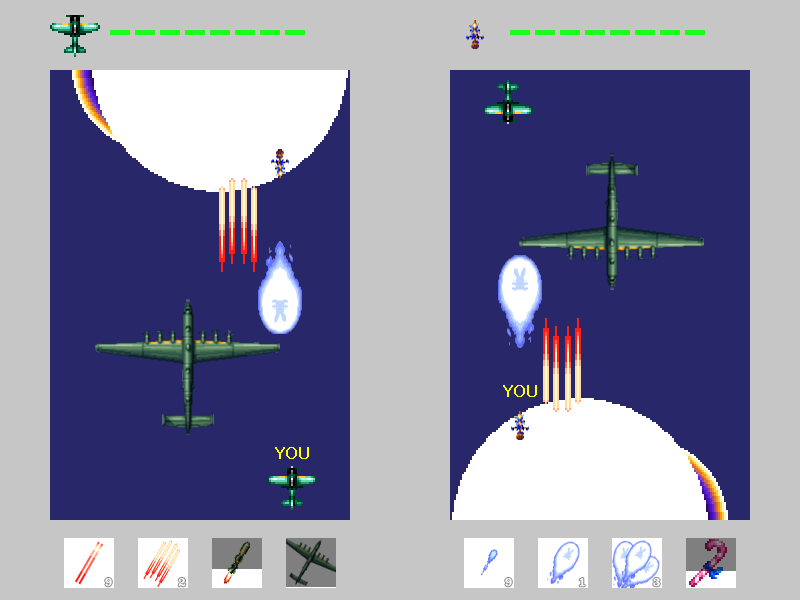
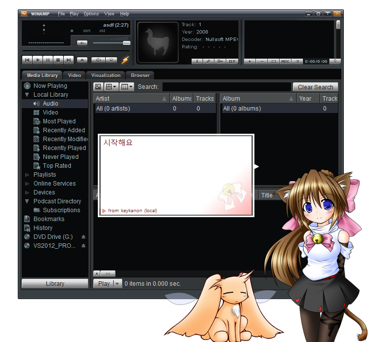

# PORTFOLIO

> **이름:** 정문준     
> **생년월일:** 94.3.14    
>
> 한양대학교 컴퓨터전공 졸업       
> 한양대학교 대학원 컴퓨터소프트웨어학과 석박사통합과정 수료
>
> 기타      
> 2012~2016 한양대학교 게임개발동아리 OOPArts 활동

# Programming Skills
> 이름 (본인 평가 점수/10 만점)       
> C/C++ (9/10)       
> C# (7/10)        
> DirectX9 (8/10)        
> Unity (4/10)         

# 참여 작품(1인 개발 작품)
### 1. goobeat - 2012 [link](https://github.com/ingerking/goobeat)    
채보를 자동으로 생성하는 리듬 게임 (사용 언어: C++/DirectX9)     
  

     

### 2. Jako - 2014 [link](https://github.com/ingerking/jako)   
2D 보스 러시 슈팅 게임 (사용 언어: C++/DirectX9)  
  

       

### 3. charmugen - 2015 [link](https://github.com/ingerking/charmugen)    
2D 대전 격투 게임 (사용 언어: C++/DirectX9)      
  

     

### 4. Dodge And Shooting - 2016 [link](https://github.com/ingerking/DAS)      
2인용 2D 종스크롤 대전 슈팅게임 (사용 언어: C++/DirectX9) 
  

    

### 5. keykanon - 2017 [link1](https://github.com/oopartians/keykanon) [link2](https://github.com/ingerking/keykanon_back)    
Sakura Script Transfer Protocol을 사용하는 winamp 가사 재생 플러그인 (사용 언어: C++)   

Sakura Script Transfer Protocol을 사용하는 winamp 가사 재생 플러그인 (사용 언어: C++)    

# 참여 프로젝트(연구과제)     
실감교류 확장공간에서 원격 사용자 간 인터랙션을 위한 창발적 아바타 동작생성 기술 개발         

참여 기간 : 2018-2019 (과제 총 기간 2013-2019)      
연구실 담당 업무 : Inverse Kinematics, 보행, 잡기의 3개 모듈을 프레임워크에 통합       

역할        
> 연구실 내 과제 실무 책임(PM?)       
> 보고서 작성       
> 상위기관 회의 참석 및 발표        
> 세부 3개 모듈 통합 과정에서 발생 이슈 해결      
> Inverse Kinematics 모듈 관리       

DeepXR : 심층 극사실감 연구      

참여 기간 : 2019~2022     
연구실 담당 업무 : 적은 수의 예제 동작을 사용하여 가상 캐릭터가 자연스럽게 움직이도록 하는 연구     

역할        
> 과제 실무 책임       
> 제안서 및 보고서 작성     

실 공간 대상 XR 생성 및 변형/증강 기술 개발     

참여 기간 : 2021~현재(2023)     
연구실 담당 업무 : 입력 물체로부터 물성 추적, 캐릭터의 조작/이동 및 이에 따른 패시브/액티브 시뮬레이션, 스타일 전이 시뮬레이션(최종 목표 : Unity 상에서 구동)        

역할       
> 과제 실무 책임      
> 제안서 및 보고서 작성       
> 상위기관 회의 참석 및 발표      
> 연구실에서 개발한 보행 모듈 및 물리 시뮬레이터 Unity로 통합       
> 통합 시 발생 이슈 해결       
> 다른 참여 회사(Unity를 Android로 포팅)와의 협업 담당       

# 참여 논문
시뮬레이터 기반 iSSD에서 데이터 마이닝 알고리즘 성능 평가      
Data mining in intelligent SSD: Simulation-based evaluation     
Fast Text Placement Scheme for ASCII Art Synthesis